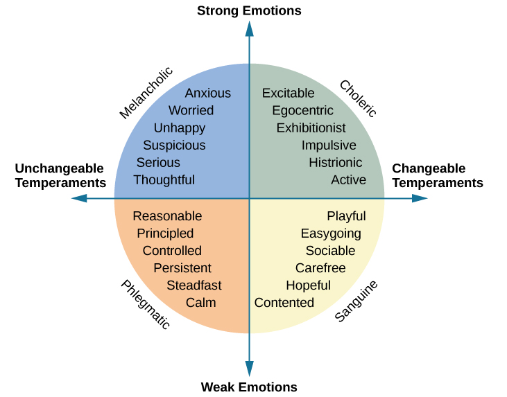
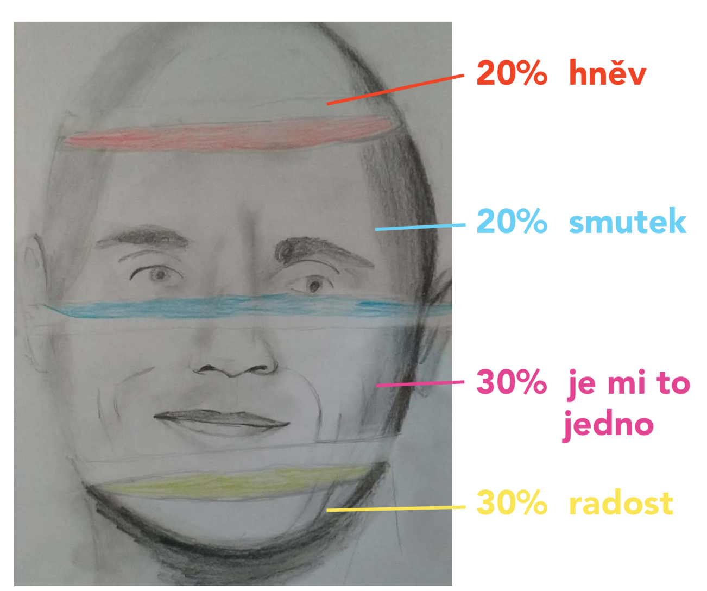
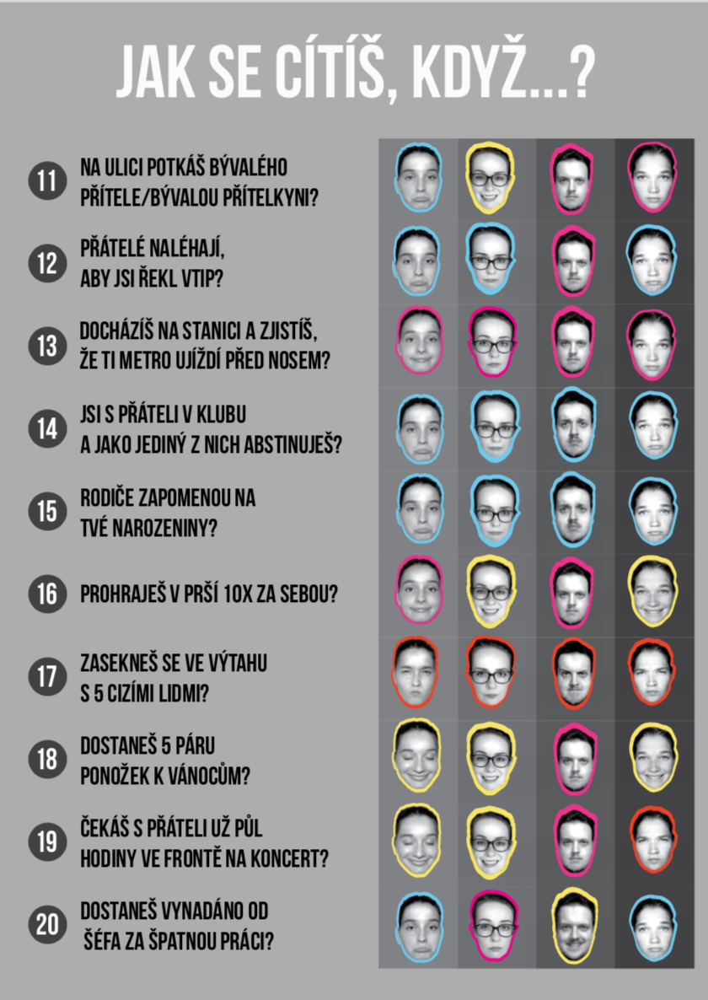

# Four Temperaments Theory infographic poster 

 For the final "ATELIER" project of my 2nd year at university we were given following instructions:

 Create small groups and come up with an eye catching infographic poster.

 I had successfully found my three project buddies and the work could begin!

 I'd say that the most challenging part was the actual search for the topic of our poster. After several ideas thrown into the ring by my colleagues and myself, we decided to go for something that dives into the depths of ourselves - our personalities.

 So as the title of this case study suggests, we decided to create a poster which would uncover your temperament. Based on the Hippocrates' temperament typology circle, extended by the studies of I. P. Pavlov and C. G. Jung, we created a questionnaire with a specific set of answers which would by the end result in discovery of your own temperament. Of course we were aware that no one's personality is strictly set on only one of the types. Therefore we agreed to show each temperament of one individual using a percentage. 
 
 **The temperament chart**

 
 
 
 
 Here's a basic sketch of our idea

  
We had also created our own emojis, using our pictures with different facial expressions. Inspired by the ones below

In order to design our desired poster we decided to involve each one of us in the experiment and took the test-questionaire ourselves.

