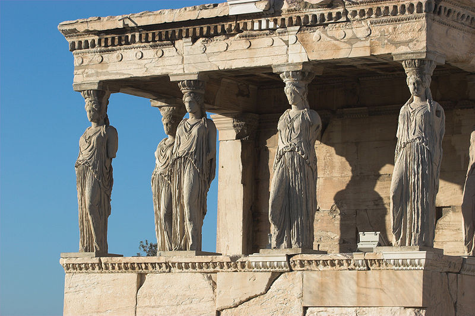
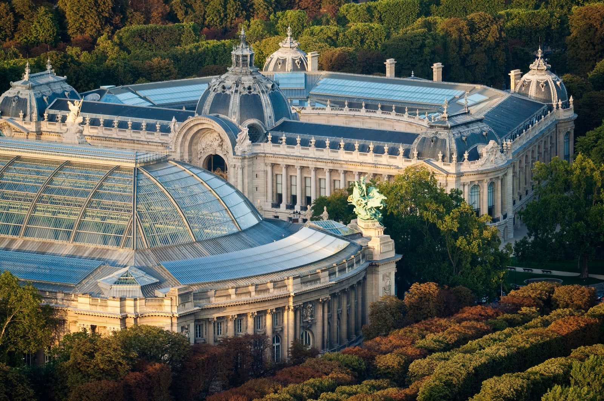
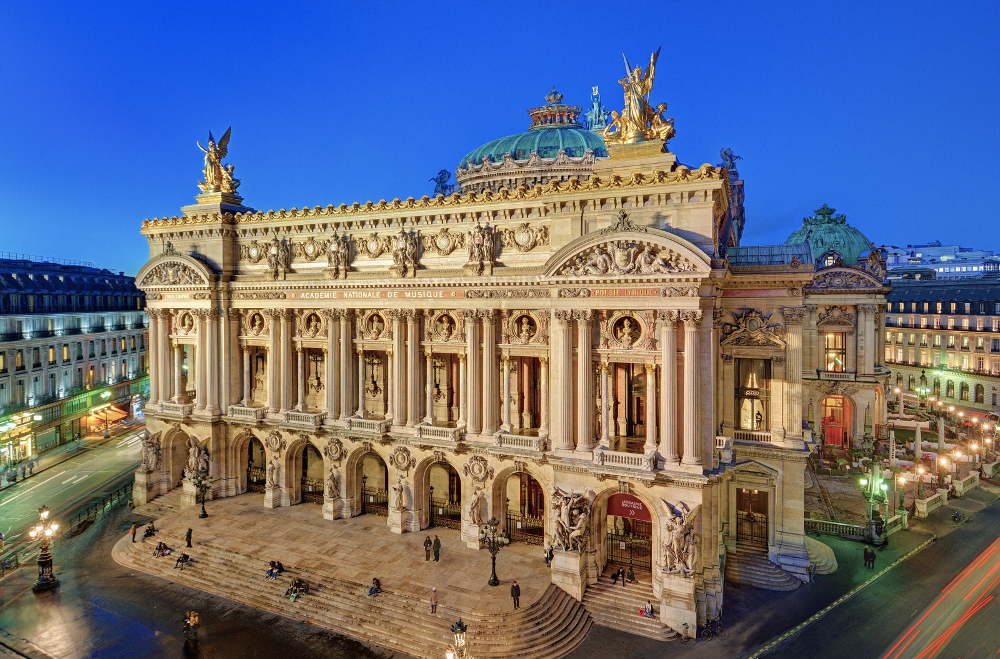

# VI

Copying. What is it to copy? Sometimes we're not even aware of doing so. And sometimes we are. 
In our modern era, there had been so many creative pieces already designed, written and produced. I believe that in today's age it's quite a challenge to come up with something completely new, something that wouldn't resemble a piece already created by someone prior to you. It seems to me that, in a way, everything is a copy. Perhaps an improved copy, perfected copy, polished copy.  
Our socities work in patterns that we like to follow. Because it's simply comfortable. It's what we know. It's what makes us feel secure. It is something that we don't want to change because it could throw us in a chaos that we hate. 
Yet, throughout the time of humanity, there have been individuals and groups that stepped out of the crowds and brought us novelties which disrupted the perfect steady walls of our perception. 

If I were to choose a perfect example of a successful copying, it would be the classical - neoclassical architecture. Which usually denotes architecture which is more or less consciously derived from the principles of Greek and Roman architecture of classical antiquity. And later on its perfected version of Beaux-Arts architecture. Just look at the Parisian Grand Palais, Musée D’Orsay or the Palais Garnier which is like a Corinthian temple dipped in a Rococo palace. You could say that these architectonic gems are a copy of other styles, sewn together, making one.

And I truly think that in this case, it's more than wonderful that the majectic beauty of antiquity was brought back to later centuries.

Grand palais

L'Opera

